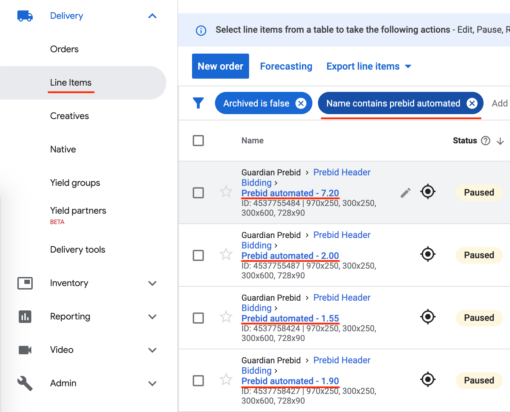

# Header Bidding

Header bidding is the process of running an auction for an ad slot with third party vendors.

The objective is to maximize the potential ad revenue for our ad slots rather than solely relying on Google Ad Manager's (GAM) marketplace.

The process is performed client side before making a request to GAM.

## Process


### 1. Auction Initialised

The auction is initiated client side by the commercial.js bundle.

We use prebid.js to orchestrate the auction with the third party ad vendors and return the winning advert.

### 2. Auction Complete

Once the auction has completed the details of the winning advert is set on the page targeting object which will be used by GAM.

### 3. GAM Request

GAM is invoked to display an ad. It will use the page targeting object to try to match against a line item (i.e. an ad order).

### 4. GAM Line Item Matching

In GAM we have programmtically created line items for each third party vendor and price level (e.g £0.50, £0.55, £0.60 etc) to match against each possible winning auction bid.

### 5. GAM Renders Advert On Client

If a line item is matched, the result is a creative containing a script that will render the vendors ad using the information previously set on the page targeting object.

## Code Process

### 1. Auction Initialised

#### Commercial Bootstrap

We have the following entry points in the commercial code:

-   [commercial.dcr.ts](https://github.com/guardian/frontend/blob/1edd86365d3fdc0e85961979ffe7805c3af7d820/static/src/javascripts/bootstraps/commercial.dcr.ts)
-   [commercial-legacy.ts](https://github.com/guardian/frontend/blob/1edd86365d3fdc0e85961979ffe7805c3af7d820/static/src/javascripts/bootstraps/commercial-legacy.ts) (deprecated)

Both prepare an array of modules to invoke, amongst the first is the module `preparePrebid`:

```js
commercialModules.push(
    ['cm-prepare-prebid', preparePrebid],
```

#### prepare-prebid.js

The commercial bootstrap will invoke:

[dfp/prepare-prebid.ts init()](https://github.com/guardian/frontend/blob/1edd86365d3fdc0e85961979ffe7805c3af7d820/static/src/javascripts/projects/commercial/modules/dfp/prepare-prebid.ts#L60)

This does the following:

-   ensure prepare prebid is called only once
-   ensures that prebid can be run according to consent and various switches
-   loads prebid.js **dynamically**
-   invokes `prebid.initialise()`, passing the consent state framework

#### prebid.js

`prepare-prebid.ts` will invoke:

[header-bidding/prebid/prebid.ts intialise()](https://github.com/guardian/frontend/blob/1edd86365d3fdc0e85961979ffe7805c3af7d820/static/src/javascripts/projects/commercial/modules/header-bidding/prebid/prebid.ts#L223)

This does the following:

-   configure prebid.js including the current bidding timeout of 1500ms
-   register a callback for the `bidWon` event to set the size of the advert

#### load-advert.ts

When an ad is loaded (or refreshed) all header bidding suppliers (prebid.js and a9) are called to request bids.

[dfp/load-advert.ts loadAdvert()](https://github.com/guardian/frontend/blob/1edd86365d3fdc0e85961979ffe7805c3af7d820/static/src/javascripts/projects/commercial/modules/dfp/load-advert.ts#L33)

```ts
// simplified
export const loadAdvert = (advert) => {
	advert.whenSlotReady
		.then(() => {
			advert.startLoading();
			return Promise.all([
				prebid.requestBids(advert),
				a9.requestBids(advert),
			]);
		})
		.then(() => {
			// display advert
			window.googletag.display(advert.id);
		});
};
```

### 2. Auction Complete

In `prebid.ts requestBids()` there is a bid completion callback `bidsBackHandler()`

This will in turn call `window.pbjs.setTargetingForGPTAsync()` to set the advert details on Google's Page Targeting (GPT) object:

[header-bidding/prebid/prebid.ts requestBids()](https://github.com/guardian/frontend/blob/1edd86365d3fdc0e85961979ffe7805c3af7d820/static/src/javascripts/projects/commercial/modules/header-bidding/prebid/prebid.ts#L429)

```ts
window.pbjs.requestBids({
    adUnits,
    bidsBackHandler() {
        // set page targeting object
        window.pbjs.setTargetingForGPTAsync([adUnits[0].code]);
        adUnits.forEach((adUnit) => {
            eventTimer.trigger('prebidEnd', stripDfpAdPrefixFrom(adUnit.code)),
        });
        resolve();
    },
});
```

### 3. GAM Request

As we saw previously in `load-advert.ts` when all header bidding suppliers have resolved, GAM is called to display the advert.

GAM will use the properties set by `prebid.js` on the page targetting object.

```ts
// simplified
export const loadAdvert = (advert) => {
	advert.whenSlotReady
		.then(() => {
			advert.startLoading();
			return Promise.all([
				prebid.requestBids(advert),
				a9.requestBids(advert),
			]);
		})
		.then(() => {
			// display advert
			window.googletag.display(advert.id);
		});
};
```

We can see this in action by inspecting network requests in the browser developer tools.

Filtering by requests to GAM i.e. `https://securepubads.g.doubleclick.net/gampad/ads?`

Amongst the **request url parameters** sent to GAM there is the `prev_scp` parameter which contains key value pairs prefixed with the string `hb-` which denotes header bidding parameters.

Some of the more important ones that will be used by GAM are:

```
hb_pb=11.48                     // price bid
hb_adid=333ff9cc105fcf71-2-0    // advert id
hb_bidder=ozone                 // bidder
```

The **response header** contains the following useful parameters:

```
google-creative-id: 138269767681
google-lineitem-id: 5058222438
```

Values of `-2` indicate that an ad was not matched.

### 4. GAM Line Item Matching

In [Google Ad Manager](https://admanager.google.com/) under line items, we can filter 'name' by 'prebid automated' to see all prebid line items.

Notice there is a line item for each bid price:



Opening a line item and inspecting the 'Ad targeting' section we can see how the line items are matched to the header bidding `hb_` parameters we saw earlier:


### 5. GAM Renders Advert On Client

The creative associated with the matched line item in GAM is typically a script which will load the correct ad via the header bidding provider.

GAM will load this script in an iframe on the user's browser.

Here is an example header bidding creative script which includes a parameter for `hb_adid`, i.e. the advert id:

```html
<script>
	try {
		window.top.pbjs.renderAd(document, '%%PATTERN:hb_adid%%');
	} catch (e) {}
</script>
```

## Other

### Generating GAM Line Items

You may have noticed that there are separate line items for each bid price.

Each of these line items are programatically created by scripts in the following repository:

https://github.com/guardian/commercial-tools/tree/main/dfp-line-item-creator

### prebid.js version

The version of prebid.js used by commercial is a forked custom version:

https://github.com/guardian/Prebid.js#681fbb

The reasons for the custom verion is detailed here:

https://github.com/guardian/Prebid.js/blob/master/GUARDIAN_modifications.md

#### Debugging prebid.js

Adding `?pbjs_debug=true` to the URL will output prebid.js debug information to the developer console.
