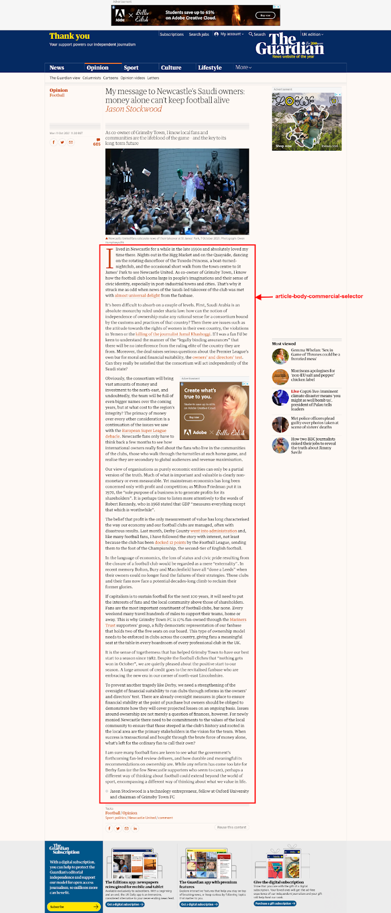
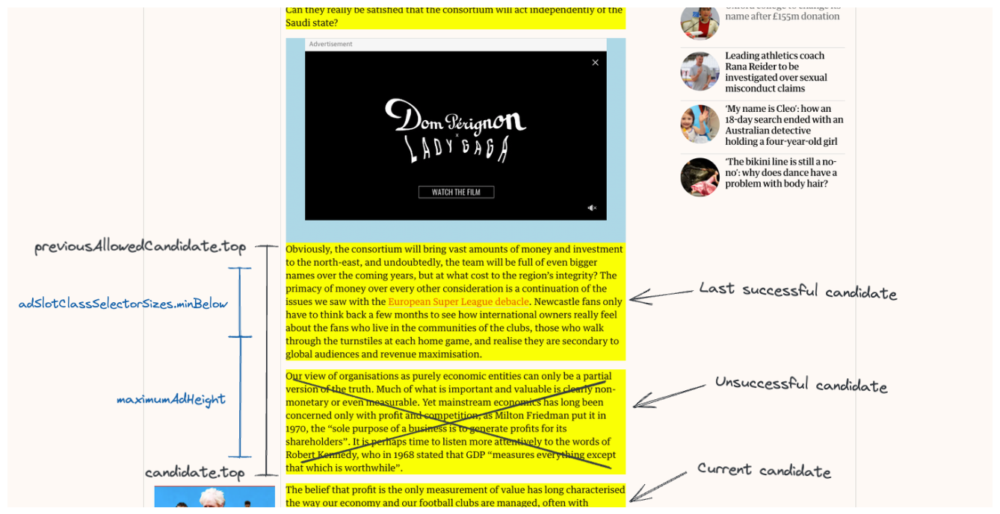
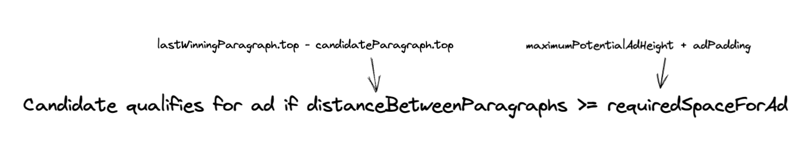

# Spacefinder

Spacefinder identifies slots in articles where ads can be inserted dynamically. Every paragraph is assessed against a set of rules, with 'winning' candidates having ads placed above them.

- [How Spacefinder works](#how-spacefinder-works)
- [Spacefinder rules](#spacefinder-rules)
- [Style and layout of dynamic ads](#style-and-layout-of-dynamic-ads)

Ideally Spacefinder hits the sweet spot between high ad ratio for us and a peerless reading experience for the Guardian website visitors.

---

## How Spacefinder works

Some ad slots on the website are fixed. Come rain or shine, they're there. These include:

- The banner slot above the navbar on desktop
- A space to the top right of articles on desktop

By contrast, ad slots identified by Spacefinder vary from page to page. A short article may only have space for one, while a long read ought to fit many more.

Once a page has loaded, Spacefinder cycles through the paragraphs inside the `article-body-commercial-selector` container, highlighted below. (The Adobe / Billie Eilish ad is an example of an ad inserted by Spacefinder.)

Within this space, ‘candidate’ paragraphs are assessed in relation to the last ‘winner’. If the candidate paragraph is far enough away from the last winning paragraph - and from any other specified element types - an ad can be added in front of it. If not, Spacefinder moves on to the next paragraph.

The space between paragraphs is calculated using the CSS ‘top’ property. There are too many moving parts (e.g. filtering for specific elements) for there to be a catch-all equation that sums up what Spacefinder does, but the gist of it is:

***If the distance between the top of the last winning paragraph and the top of the candidate paragraph is greater than or equal to the maximum potential ad height plus padding, the candidate paragraph qualifies for an ad.***

Or to simplify it further:

The value names above are made up to try to boil the essentials down - they don’t match what’s going on in the code itself. The ad heights mentioned are pulled in from [`ad-sizes.js`][].

[`ad-sizes.js`]: https://github.com/guardian/commercial-core/blob/main/src/ad-sizes.ts

---

[ [Back to top &uarr;](#spacefinder) ]

---

## Spacefinder rules

Rules are currently set in [`article-body-adverts.js`][] in the frontend repository. The desktop configuration sits inside `addDesktopInlineAds`, which has two sets of rules. The mobile configuration is inside `addMobileInlineAds`.

[`article-body-adverts.js`]: https://github.com/guardian/frontend/blob/main/static/src/javascripts/projects/commercial/modules/article-body-adverts.js

### Desktop

#### First round (`defaultRules`) - skipped for paid content pages

- At least 300px of space above (700px on immersive pages)
- At least 300px of space below (700px if `isDotcomRendering` returns `false`)
- At least 5px above and 190px below any `<h2>` elements
- At least 500px from any other ad, above and below

#### Second round (`relaxedRules`)

- At least 1000px of space above (1600px on paid content)
- At least 300px of space below paragraph (800px if `isDotcomRendering` returns `false`)
- At least 500px from any other ad, above and below

### Mobile

#### Only round (`rules`)

- Minimum of 200px of space above and below paragraph
- At least 100px above and 250px below any `<h2>` elements
- At least 500px from any other ad, above and below

---

[ [Back to top &uarr;](#spacefinder) ]

---

## Style and layout of dynamic ads

On desktop, the first inline ad sits inside the body of the article copy. All subsequent ‘inline’ ads on desktop sit in the white space to the right. On mobile they're all part of the content column.
