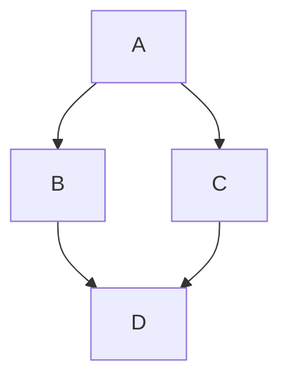

# Where are adverts suppressed on theguardian.com?

## In Articles

There are two main reasons we wouldn't show ads on articles:

- `shouldHideAds` has been checked in Composer (the Guardian's Content Management System) for articles
  This means that the article has been deemed unfit for advertising. This can happen for a range of reasons. It could be sensitive content, where displaying ads might feel inappropriate. It could also be because we know ads don't currently work well with these content types (e.g. Immersive articles)
  In this case:
    - [dotcom-rendering will not insert server-side ads]()
    - [the commercial bundle will not insert dynamic ads](https://github.com/guardian/commercial/blob/6092dc229599a3a5ada327bad79eb34b7ff044b2/bundle/src/lib/should-load-ads.ts)

- The user has a premium product which comes with an ad free feature (`isAdFree`)
  This means that adverts should be disabled for these users across the site on all pages
  This also means that branded content (Guardian Labs) should be stripped from fronts and onward journey components as these count as advertisements

TODO - fill out a Mermaid diagram to demonstrate when we load ads:

## For Fronts and Tag Pages

When fronts and tag pages, we don't currently have a way of preventing ads rendering in the same way as articles, though it is possible to:

- Negatively target the page via GAM
  It is possible to set up a line item in Google Ad Manager with no demand associated with it. This can be used to prevent ads appearing on certain categories of content
- Update our Commercial bundle code to explicitly prevent ads running under certain conditions

## Miscellaneous

We will also never show ads on:

- Identity pages (e.g. https://profile.theguardian.com)
- Help pages (e.g. https://manage.theguardian.com/help-centre)
- Children's books site (https://www.theguardian.com/childrens-books-site)
